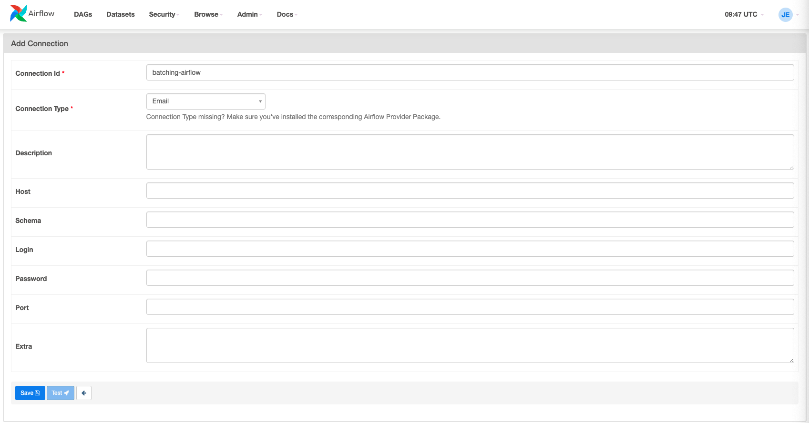

# Introduction to Airflow

## Introduction

In this chapter, we'll introduce [Apache Airflow](../pills/batching_and_apache_airflow.md) and demonstrate how to set up a connection with PostgreSQL.

:heavy_exclamation_mark: Make sure you go through the linked pill above to
expand your knowledge as you go through this content.

You do not necessarily need to follow the mentioned order, but make sure to tap
into the linked resources as they will be very useful.


## Setting things up

### Setting up Apache Airflow

We will do this in a virtual environment, so that we isolate dependencies and
maintain a clean development environment.

Once you have your virtual environment, you can follow along if you wish
(recommended)!

Note: Remember to activate your virtual environment whenever you work with
Airflow!

```bash
pip install apache-airflow
```

And next, we will initialize our database, start a web server and run the
scheduler, in order:

```bash
airflow db init
```

```bash
airflow webserver -p 8080
```

```bash
airflow scheduler
```

Alright, we have started a webserver and mapped it to port 8080.

But what does it really mean?

<details>
  <summary>And more importantly, how do we access the web interface?</summary>

  What the `airflow webserver -p 8080` command really does is to start a server locally and then it maps it to port 8080 on your localhost, meaning you can access its interface from your machine on port 8080.

  Open the browser and navigate to `http://localhost:8080`
</details>


### Setting up our PostgreSQL database and connection to Airflow

First, I will set up a PostgreSQL database called `airflow`.

```bash
createdb airflow
```

Then, I am going to create the tables needed for this demonstration:

```sql
-- Create the 'orders' table
CREATE TABLE orders (
    order_id SERIAL PRIMARY KEY,
    order_date DATE,
    customer_id INT,
    total_amount DECIMAL(10, 2)
);

-- Create the 'orders_summary' table
CREATE TABLE orders_summary (
    summary_id SERIAL PRIMARY KEY,
    total_orders INT,
    total_revenue DECIMAL(10, 2),
    summary_date DATE
);
```

Oh, and I forgot to set a UNIQUE constraint to the `summary_date` field. In
essence, we need this so that the ON CONFLICT clause can work correctly in
handling potential conflicts at the time of INSERTING.

```sql
ALTER TABLE orders_summary
ADD CONSTRAINT unique_summary_date UNIQUE (summary_date);
```

<!-- OMITTED -->

And finally, I will seed both tables with some sample data to test the Airflow
DAG later on:

```sql
INSERT INTO orders (order_id, order_date, customer_id, total_amount) VALUES
(1, '2023-01-01', 1, 100),
(2, '2023-01-01', 2, 200),
(3, '2023-01-02', 1, 150),
(4, '2023-01-03', 2, 250),
(5, '2023-01-03', 3, 300);
```

```sql
INSERT INTO orders_summary (summary_date, total_orders, total_amount) VALUES
('2023-01-01', 2, 300),
('2023-01-02', 1, 150);
```

### Setting up the connection in Airflow

We are going first to visit the web interface, as we saw before. So I navigate
to `http://localhost:8080`.

And I am prompted to log in, the default credentials used to be `airflow` for
both the username and the password.

However, this has changed recently, and we
need now to [create an admin user](https://airflow.apache.org/docs/apache-airflow/stable/administration-and-deployment/security/webserver.html#web-authentication).


After you have your user, you should be able to log in via the web interface.

Now, in the main navigation bar, if you click on `Admin`, and then
`Connections`, you will be able to see all the existing connections.

We need to create a new one with our local postgres.

You should be able to see something like .
_If you do not, please let your coach know._


Now we will break down what all these sections mean and what we need to do about
these to set up the connection:
1. Connection Id: We will use this ID in our DAG to refer to this connection. Enter a unique name (e.g. batching-airflow).

2. Conn Type: Choose "Postgres" from the dropdown menu.

It is likely you do not see this connection type in your dropdown. To save you
the research, I will tell you that from Apache 2.0 onward, provider packages are
separate from the main Airflow package, so we need to install it individually.

We will do this within our `venv`:
```bash
pip install apache-airflow-providers-postgres
```

Now, check the dropdown again! What do you notice? Is that what you expected?

Think about what is happening before...

<details>
  <summary>... you check this hint</summary>

  Our webserver was already started, and it won't pick this change (new provider
  added) automatically, so we need to restart it!
</details>

3. Host: The hostname of our PostgreSQL database.

4. Schema: Enter the name of the database you want to connect to.

5. Login: Enter your PostgreSQL username.

6. Password: Enter your PostgreSQL password.

7. Port: 5432 is the default postgres port.

Then we click on `Save` to create the connection, note that you can also `Test`
the connection if you wish (recommended!).

We can now use this connection in our DAG to interact with our PostgreSQL
database.


[Next Challenge](02_your_first_dag_in_airflow_bite.md)

<!-- BEGIN GENERATED SECTION DO NOT EDIT -->

---

**How was this resource?**  
[😫](https://airtable.com/shrUJ3t7KLMqVRFKR?prefill_Repository=makersacademy%2Fbatch-processing&prefill_File=batching_bites%2F01_introduction_to_airflow_bite.md&prefill_Sentiment=😫) [😕](https://airtable.com/shrUJ3t7KLMqVRFKR?prefill_Repository=makersacademy%2Fbatch-processing&prefill_File=batching_bites%2F01_introduction_to_airflow_bite.md&prefill_Sentiment=😕) [😐](https://airtable.com/shrUJ3t7KLMqVRFKR?prefill_Repository=makersacademy%2Fbatch-processing&prefill_File=batching_bites%2F01_introduction_to_airflow_bite.md&prefill_Sentiment=😐) [🙂](https://airtable.com/shrUJ3t7KLMqVRFKR?prefill_Repository=makersacademy%2Fbatch-processing&prefill_File=batching_bites%2F01_introduction_to_airflow_bite.md&prefill_Sentiment=🙂) [😀](https://airtable.com/shrUJ3t7KLMqVRFKR?prefill_Repository=makersacademy%2Fbatch-processing&prefill_File=batching_bites%2F01_introduction_to_airflow_bite.md&prefill_Sentiment=😀)  
Click an emoji to tell us.

<!-- END GENERATED SECTION DO NOT EDIT -->
