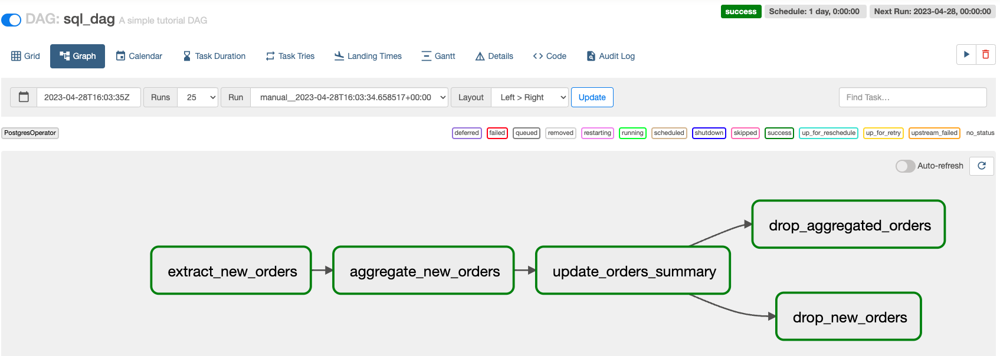

# Your first DAG in Airflow

_**This is a Makers Bite.** Bites are designed to train specific skills or
tools. They contain an intro, a demonstration video, some exercises with an
example solution video, and a challenge without a solution video for you to test
your learning. [Read more about how to use Makers
Bites.](https://github.com/makersacademy/course/blob/main/labels/bites.md)_

Learn to orchestrate the execution of batch data processing tasks that depend on
each other using Apache Airflow.


## Introduction

In the previous chapter, we worked out all the setup we needed to go to start
our batching journey.

In this bite, we will write a
[Directed Acyclic Graph (DAG) that chains several SQL tasks](../pills/dag_and_tasks_in_airflow.md) to run in a
predefined order.

:heavy_exclamation_mark: Make sure you go through the linked pill above to
expand your knowledge as you go through this bite.

You do not necessarily need to follow the mentioned order, but make sure to tap
into the linked resources as they will be very useful.

## Demonstration

We are going to demonstrate how to write an Airflow DAG that chains SQL tasks.

In this demonstration, we'll be working with two tables: `orders` and
`orders_summary`. The orders table contains order records, and the
orders_summary table stores the aggregated order data.

_Note: Remember that we seeded both tables in the previous chapter?_

There will be three SQL tasks that will run in a predefined order in this case
scenario:
1. Extract new orders since the last update of the orders_summary table.
2. Aggregate the new orders by date.
3. Update the orders_summary table with the aggregated data.


### Setup

We will start by creating the DAG file, I have named it `sql_dag.py`. And I have
placed it in a `dags` folder I have created next to my venv.

_Note: You can create your dags folder whenever you prefer really, I just
thought it belonged there!_

This is the content of the file:

```python
from datetime import datetime, timedelta

from airflow import DAG
from airflow.providers.postgres.operators.postgres import PostgresOperator

default_args = {
    'owner': 'airflow',
    'depends_on_past': False,
    'email_on_failure': False,
    'email_on_retry': False,
    'retries': 1,
    'retry_delay': timedelta(minutes=5),
}

dag = DAG(
    'sql_dag',
    default_args=default_args,
    description='A simple tutorial DAG',
    schedule_interval=timedelta(days=1),
    start_date=datetime(2023, 4, 28),
    catchup=False,
)

extract_new_orders = """
    CREATE TABLE IF NOT EXISTS new_orders AS
    SELECT order_id, order_date, total_amount
    FROM orders
    WHERE order_date >= '{{ prev_ds }}'
    AND order_date <= '{{ ds }}';
"""

# extracts new orders since the last update of the orders_summary table.
t1 = PostgresOperator(
    task_id='extract_new_orders',
    sql=extract_new_orders,
    postgres_conn_id='your_connection_id',
    dag=dag,
)


aggregate_new_orders = '''
    CREATE TABLE IF NOT EXISTS aggregated_orders AS
    SELECT order_date AS date, COUNT(*) AS total_orders, SUM(total_amount) AS total_amount
    FROM new_orders
    GROUP BY order_date;
'''

# aggregates the new orders by date.
t2 = PostgresOperator(
    task_id='aggregate_new_orders',
    sql=aggregate_new_orders,
    postgres_conn_id='your_connection_id',
    dag=dag,
)

update_orders_summary = """
    INSERT INTO orders_summary (summary_date, total_orders, total_amount)
    SELECT date, total_orders, total_amount
    FROM aggregated_orders
    ON CONFLICT (summary_date) DO UPDATE SET
        total_orders = orders_summary.total_orders + excluded.total_orders,
        total_amount = orders_summary.total_amount + excluded.total_amount;
"""

# updates the orders_summary table with the aggregated data.
t3 = PostgresOperator(
    task_id='update_orders_summary',
    sql=update_orders_summary,
    postgres_conn_id='your_connection_id',
    dag=dag,
)

drop_new_orders = '''
DROP TABLE new_orders;
'''

t4 = PostgresOperator(
    task_id='drop_new_orders',
    sql=drop_new_orders,
    postgres_conn_id='your_connection_id',
    dag=dag,
)

drop_aggregated_orders = '''
DROP TABLE aggregated_orders;
'''

t5 = PostgresOperator(
    task_id="drop_aggregated_orders",
    sql=drop_aggregated_orders,
    postgres_conn_id="your_connection_id",
    dag=dag,
)

t1 >> t2 >> t3 >> [t4, t5]

```

I know I said there would be three tasks. There are five, but the last 2 are for
cleanup purposes really.

Note: Replace `your_connection_id` with your PostgreSQL connection ID in Airflow.

Now the idea is that when you save this file, we can find it under the `DAGs`
section in the Airflow interface.

Do you see it?

<details>
  <summary>Click to find out more!</summary>

  Unless you have placed your dag file under the default dags folder location
  for Airflow, you will not be able to see it.

  To update the location where Airflow looks at to find dags locally on your
  machine, do the following:

  Find and update the airflow.cfg file: By default, the airflow.cfg file is
  located in the ~/airflow directory. This is created when you first initialize
  Airflow by running airflow db init.

  All you have to do is updating the config file, more specifically the
  `dags_folder` variable with the absolute path to your dags.

  <details>
    <summary>Does not work yet?</summary>

    It is likely you forgot to do one last thing before you can view your dag in the Airflow interface!

    From the previous chapter, do you remember what we did?
  </details>
</details>


### Understanding and running our DAG

Alright, so now that you're able to locate the DAG in the Airflow interface, you
may be wondering: **How do I run it?**

As it stands, your DAG may appear as `Paused` in the DAG list on Airflow.

To unpause it, just click the toggle on the very left of the DAG.

However, I have a question for you: **When would the DAG run?**


<details>
  <summary>Click here to find out more!</summary>

  ```python
  dag = DAG(
      'sql_dag',
      default_args=default_args,
      description='A simple tutorial DAG',
      schedule_interval=timedelta(days=1),
      start_date=datetime(2023, 4, 28),
      catchup=False,
  )
  ```

  As it stands, this is set to run every day, it is somewhat intuitive, but you
  may need to do some research to fully understand what this code does and to
  get more familiar with it. Totally fine.
</details>


:rotating_light: Do not keep reading if you are still thinking about the last
question!

Now that we understand the DAG a bit more, we are going to run it with immediate
effect!

We do not need to wait around until the scheduler decides to start the tasks at
midnight.

We can click on the small `Play` button on the right part of our dag (just below
action). That will make the DAG run according to the definition of our file.


At the end of our flow, we expect to see something like this .

All our tasks (each of the rectangles) are green!

:information_source: If anything goes wrong, you can check the logs of each individual task.

I will let you explore the Airflow interface, but if you are able to access the
`Graph` view of each of the Airflow runs, you can inspect each rectangle (task)
individually, and the logs should be visible to you from there.

This is the best way to get visibility and see what may be happening inside each
of these tasks!


<!-- OMITTED -->


This example demonstrates the power of batch processing by automating the
process of updating the `orders_summary` table.

Instead of manually running a script to perform these operations, Airflow will
automatically execute the tasks, handle dependencies, and schedule the pipeline
to run at specified intervals.

This approach becomes increasingly valuable as the size of the dataset grows,
and the complexity of the transformations and dependencies increases.


## Exercise

Create an Airflow DAG to extract, transform, and load sales data into a summary table.

The goal is to calculate the total amount of sales and the number of
transactions for each sales representative by region.

Please go through the setup section below and write the DAG from scratch.

### Setup instructions:

Run the following [SQL script](../scripts/batching_bites_02_exercise.sql) to
   prepare the dataset needed for the exercise.

This script creates the three tables `sales_reps`, `regions`, and
`transactions`. It then inserts sample data into each table.

* `sales_reps` contains sales representative data, including their ID, name, and
  region ID.
* `regions` contains region data, including the region ID and name.
* `transactions` contains transaction data, including the transaction ID, sales
  representative ID, transaction date, and amount.

<details>
  <summary>Some hints to help you!</summary>

  1. You will need to create and join tables to aggregate data.
  2. Consider using subqueries or temporary tables to store intermediate
     results.
  3. The summary table should have a unique constraint to prevent duplicate
     data.
  4. Use the provided DAG template as a starting point and modify the SQL
     queries and task dependencies as needed.

</details>

<details>
  <summary>This could be a possible solution</summary>

  ```python
    from datetime import datetime, timedelta

    from airflow import DAG
    from airflow.providers.postgres.operators.postgres import PostgresOperator

    default_args = {
        'owner': 'airflow',
        'depends_on_past': False,
        'email_on_failure': False,
        'email_on_retry': False,
        'retries': 1,
        'retry_delay': timedelta(minutes=5),
    }

    dag = DAG(
        'sales_summary_dag',
        default_args=default_args,
        description='A DAG to extract, transform, and load sales data into a summary table',
        schedule_interval=timedelta(days=1),
        start_date=datetime(2023, 4, 28),
        catchup=False,
    )

    extract_and_aggregate_sales = '''
        CREATE TABLE IF NOT EXISTS aggregated_sales AS
        SELECT s.sales_rep_id, r.region_id, COUNT(s.sale_id) AS num_transactions, SUM(s.amount) AS total_amount
        FROM sales s
        JOIN sales_reps sr ON s.sales_rep_id = sr.id
        JOIN regions r ON sr.region_id = r.id
        WHERE s.sale_date >= '{{ prev_ds }}' AND s.sale_date <= '{{ ds }}'
        GROUP BY s.sales_rep_id, r.region_id;
    '''

    t1 = PostgresOperator(
        task_id='extract_and_aggregate_sales',
        sql=extract_and_aggregate_sales,
        postgres_conn_id='your_connection_id',
        dag=dag,
    )

    update_sales_summary = '''
        INSERT INTO sales_summary (sales_rep_id, region_id, num_transactions, total_amount)
        SELECT sales_rep_id, region_id, num_transactions, total_amount
        FROM aggregated_sales
        ON CONFLICT (sales_rep_id, region_id) DO UPDATE SET
            num_transactions = sales_summary.num_transactions + excluded.num_transactions,
            total_amount = sales_summary.total_amount + excluded.total_amount;
    '''

    t2 = PostgresOperator(
        task_id='update_sales_summary',
        sql=update_sales_summary,
        postgres_conn_id='your_connection_id',
        dag=dag,
    )

    drop_aggregated_sales = '''
    DROP TABLE aggregated_sales;
    '''

    t3 = PostgresOperator(
        task_id="drop_aggregated_sales",
        sql=drop_aggregated_sales,
        postgres_conn_id="your_connection_id",
        dag=dag,
    )

    t1 >> t2 >> t3
  ```
</details>


## Challenge

Your task is to create an Airflow DAG to extract, transform, and load product
sales data into a summary table.

The goal is to calculate the total quantity of each product sold.

### Setup instructions

Run the following [SQL script](../scripts/batching_bites_02_challenge.sql) to
prepare the dataset needed for the exercise.

Good luck!

## Recap

One thing you may think could be: "Well, what I have just done could be done via
a Python script like in the previous module, couldn't it?"

Yes, indeed. However, wouldn't it be annoying to have to rerun the script
periodically (e.g. every day like in the previous example) every time we want to
update our data?

With this setup, Airflow takes care of all the heavy lifting really!

Another thing you may have noticed is that the output of the batch process we
did in the demonstration did not change compared to what we had already there in
the source dataset.

And that is correct, the purpose of this exercise was to demonstrate how to use
Airflow to create a pipeline that processes and aggregates data from one table
and updates another table with the aggregated results. This is a common use case
in data engineering, where you want to maintain a summary or aggregated view of
the data for analytical purposes without modifying the original source data.


And this really are the two key things I want you to take away from this bite
really!

Excellent work so far! :star:


[Next Challenge](03_your_second_dag_in_airflow_bite.md)

<!-- BEGIN GENERATED SECTION DO NOT EDIT -->

---

**How was this resource?**  
[😫](https://airtable.com/shrUJ3t7KLMqVRFKR?prefill_Repository=makersacademy%2Fbatch-processing&prefill_File=batching_bites%2F02_your_first_dag_in_airflow_bite.md&prefill_Sentiment=😫) [😕](https://airtable.com/shrUJ3t7KLMqVRFKR?prefill_Repository=makersacademy%2Fbatch-processing&prefill_File=batching_bites%2F02_your_first_dag_in_airflow_bite.md&prefill_Sentiment=😕) [😐](https://airtable.com/shrUJ3t7KLMqVRFKR?prefill_Repository=makersacademy%2Fbatch-processing&prefill_File=batching_bites%2F02_your_first_dag_in_airflow_bite.md&prefill_Sentiment=😐) [🙂](https://airtable.com/shrUJ3t7KLMqVRFKR?prefill_Repository=makersacademy%2Fbatch-processing&prefill_File=batching_bites%2F02_your_first_dag_in_airflow_bite.md&prefill_Sentiment=🙂) [😀](https://airtable.com/shrUJ3t7KLMqVRFKR?prefill_Repository=makersacademy%2Fbatch-processing&prefill_File=batching_bites%2F02_your_first_dag_in_airflow_bite.md&prefill_Sentiment=😀)  
Click an emoji to tell us.

<!-- END GENERATED SECTION DO NOT EDIT -->
