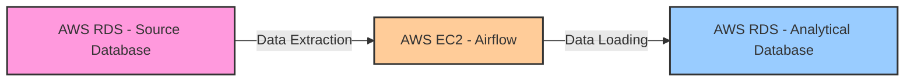

# Data pipelines with Airflow

In the first set of bites (_batching bites_) we worked through earlier this
week, we used Apache Airflow locally, and then in the last one we also did our
first data transformations in the Cloud.

Well, in this module we are going to work in a project to create our first Data
Pipeline in the Cloud using Apache Airflow!

In this project you will learn to:
* Schedule the execution of a data pipeline using Airflow
* Learn to monitor and maintain data pipelines using Airflow in the Cloud

## Introduction

As part of this project, we will explore and see what it is like working with a
real-world inspired data pipeline.

:information-source: There will be a lot of questions throughout the curriculum
for you to engage with, so please, make sure you take your time to think about
these and come up with your best possible answers!

This project will feel different to others you have done before, and that is
exactly the intention of the curriculum.

Please make sure you give us your feedback via the feedback links at the bottom
of the page! :star:

### Architecture

_This diagram illustrates the flow of data from the source database (AWS RDS -
Source Database), through the data processing step on the EC2 instance running
Airflow (AWS EC2 - Airflow), and finally into the analytical database (AWS RDS -
Analytical Database)._

**All the resources have been already created in advance by your coach.**

### Cloud tooling

You are already familiar with Apache Airflow, DAGs and task, so in this section
we will focusing on the specific Cloud services you have not come across yet:
1. [AWS RDS (Relational Database Service)](../pills/aws_rds.md).
2. [AWS EC2 (Elastic Compute Cloud)](../pills/aws_ec2.md).

## Sequence

Work through these sequentially:

1. [EC2 Setup](./01_ec2_setup.md)
2. [Warming Up](./02_warming_up.md)
3. [Project Tasks](./03_project_tasks.md)
4. [Stretch Tasks (Optional)](./04_stretch_tasks.md)

## Submitting your work

:satellite: This is a submission point, please work on it solo and submit your
work using [this form](https://airtable.com/shrvo9ePjlwnaiLv5?prefill_Item=batch_processing_data_pipelines_with_airflow_project) when you are done.

You will need to create a more detailed diagram of the whole system, including
the three main components of the architecture illustrated above (RDS source
database, EC2 instance and RDS analytical database).

Make it as detailed as you'd like, but do not forget to include to main elements
and takeaways you have learned from this project, along with any thoughts you
had.

We recommend you work on this alongside the project, so do not leave this to the
end after you have completed the project. You want to see what has been your
approach and what blockers you had along the way, how you solved them, etc.

Your coach will give you feedback on this.

<!-- BEGIN GENERATED SECTION DO NOT EDIT -->

---

**How was this resource?**  
[😫](https://airtable.com/shrUJ3t7KLMqVRFKR?prefill_Repository=makersacademy%2Fbatch-processing&prefill_File=data_pipelines_with_airflow%2FREADME.md&prefill_Sentiment=😫) [😕](https://airtable.com/shrUJ3t7KLMqVRFKR?prefill_Repository=makersacademy%2Fbatch-processing&prefill_File=data_pipelines_with_airflow%2FREADME.md&prefill_Sentiment=😕) [😐](https://airtable.com/shrUJ3t7KLMqVRFKR?prefill_Repository=makersacademy%2Fbatch-processing&prefill_File=data_pipelines_with_airflow%2FREADME.md&prefill_Sentiment=😐) [🙂](https://airtable.com/shrUJ3t7KLMqVRFKR?prefill_Repository=makersacademy%2Fbatch-processing&prefill_File=data_pipelines_with_airflow%2FREADME.md&prefill_Sentiment=🙂) [😀](https://airtable.com/shrUJ3t7KLMqVRFKR?prefill_Repository=makersacademy%2Fbatch-processing&prefill_File=data_pipelines_with_airflow%2FREADME.md&prefill_Sentiment=😀)  
Click an emoji to tell us.

<!-- END GENERATED SECTION DO NOT EDIT -->
